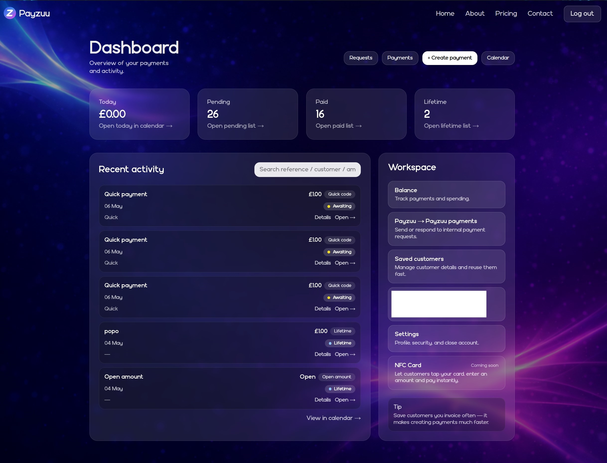
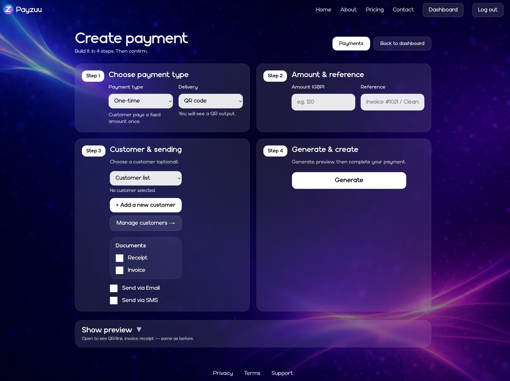
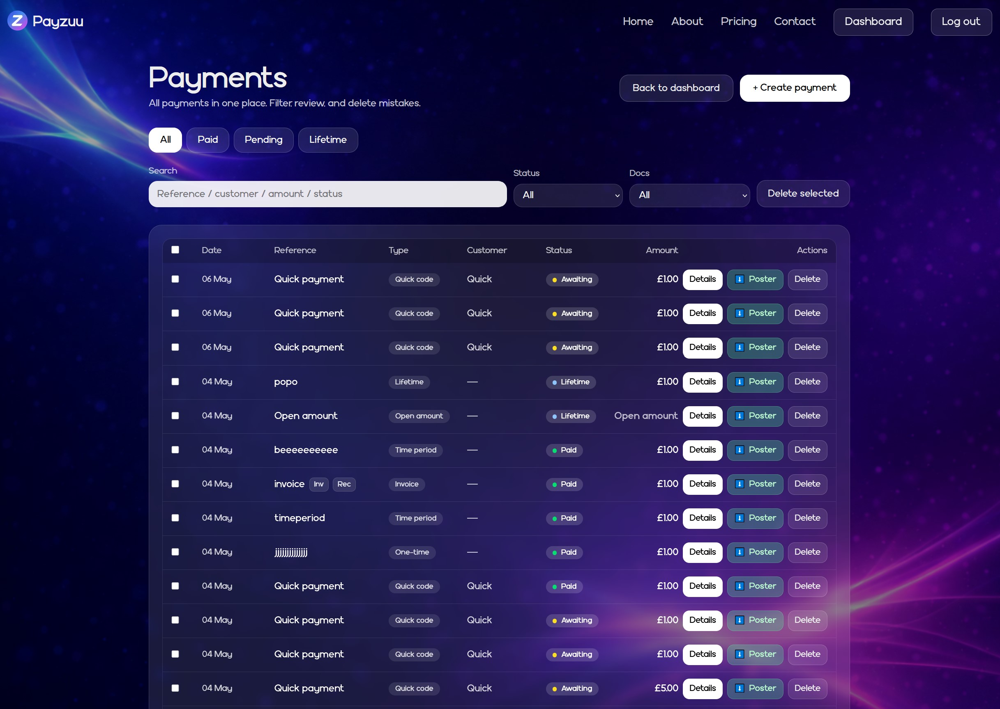
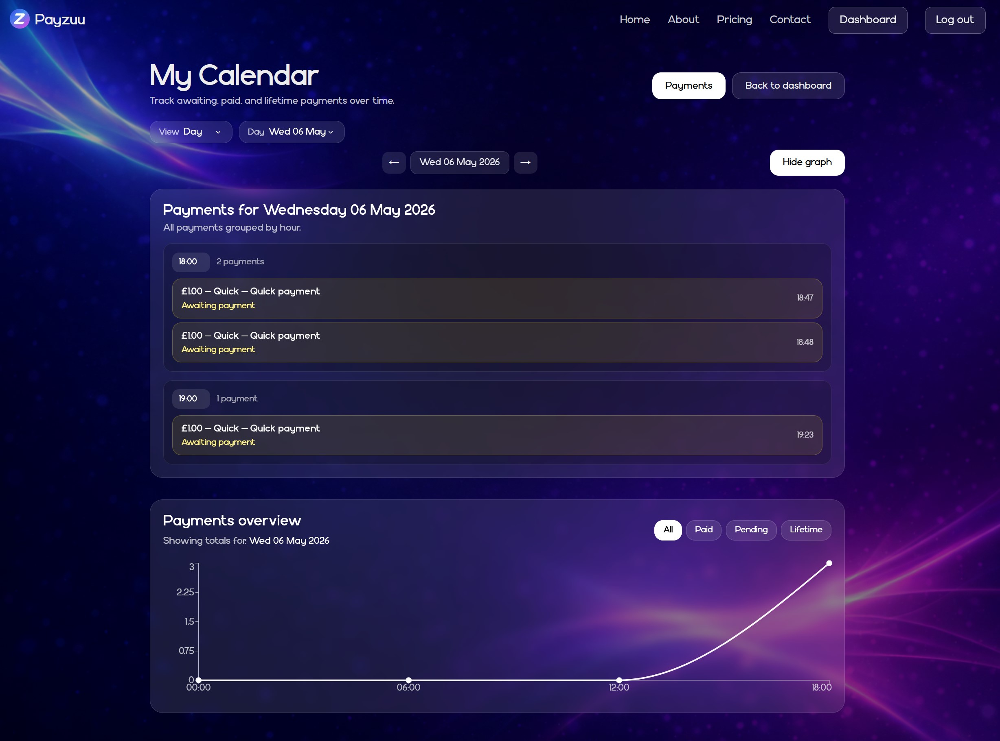

# Payzuu – QR & Link Payment Platform

Payzuu is a fast and simple payment platform that allows small businesses to accept payments using QR codes or payment links — without card machines, monthly fees, or complex setup.

The goal of the project is to make payments accessible, lightweight, and easy to use for everyday businesses and freelancers.

---

## 🚀 Key Features

- QR code payments for instant transactions  
- Payment links for remote payments
- Life notifications
- No card machines required  
- Simple and fast payment creation flow  
- Customer and payment management  
- Payment status tracking (pending, paid, lifetime)  
- Dashboard with analytics and activity overview  
- Payment requests between users  
- Optional invoice / receipt generation  

---

## 🛠️ Tech Stack

- Next.js  
- TypeScript  
- Backend Next.sj / API
- Stripe live payments
- PWA / Mobile

---

## 📸 Screenshots

### Dashboard

### Create Payment

### Payments Overview

### Calendar View

### Payment Requests

---

## 💡 About This Project

Payzuu is a real application developed to solve a practical problem — enabling fast, simple payments without traditional hardware or complex onboarding.

The platform is designed with usability in mind, focusing on a clean user experience and minimal friction when creating and managing payments.

---

## 🔐 Note

This repository is a showcase of the application.

The full production source code is private.

---

## 🎯 What I Learned

- Designing and building a real-world payment flow  
- Structuring full-stack applications  
- Working with user flows and transaction logic  
- Integrating payment systems (Stripe)  
- Building scalable and user-focused features  

---

## 🌐 Live

https://youtu.be/hpTxFlSw7G8
